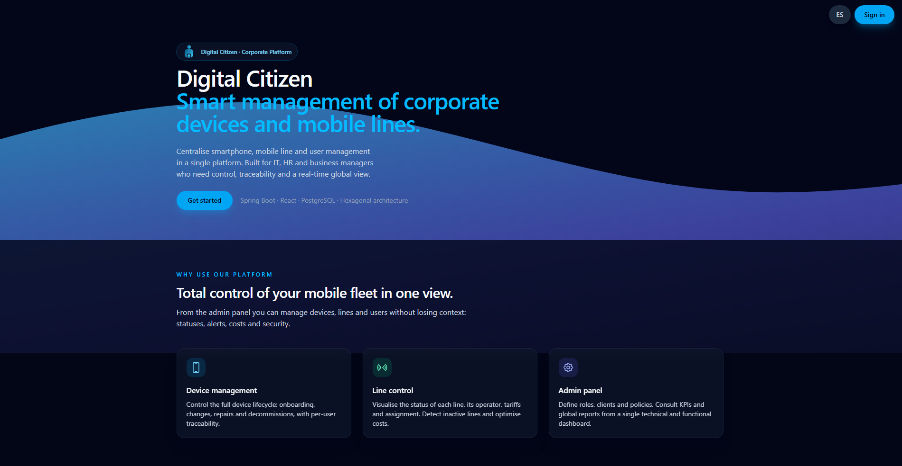
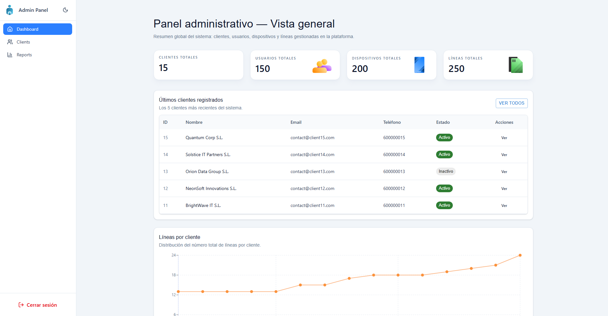
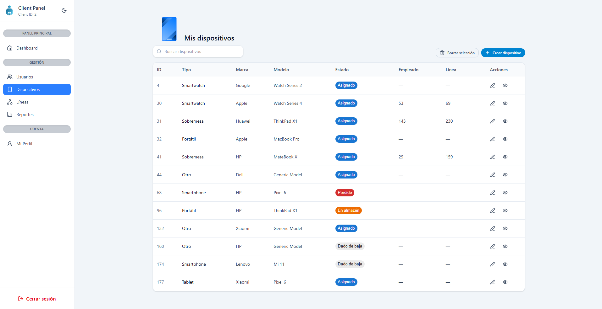
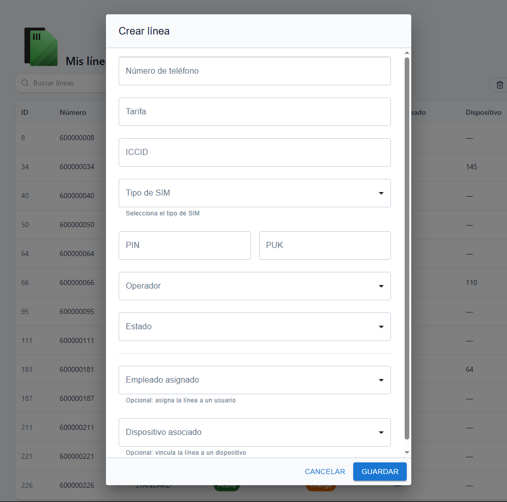
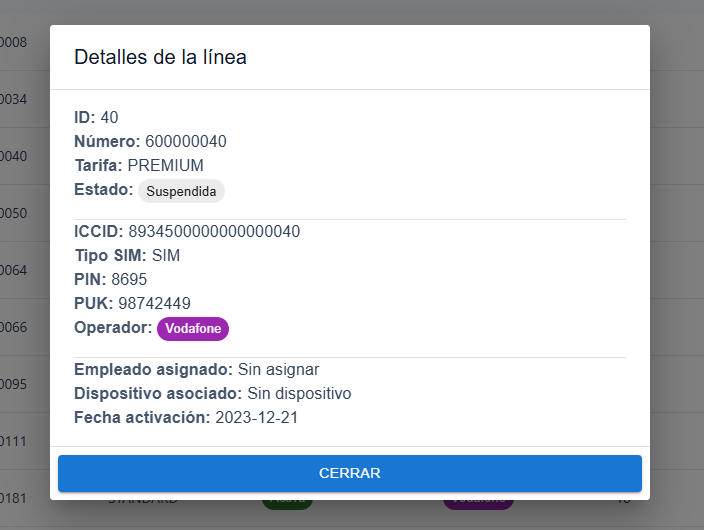
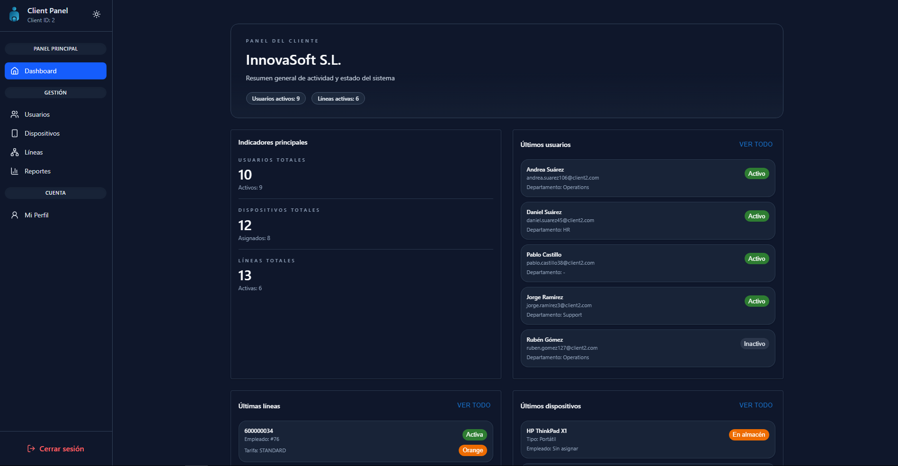

# Corporate Device Management App

Frontend for the **Digital Citizen** platform — a web application for managing corporate mobile devices, SIM lines and users across an organisation.

**Live demo:** [digital-citizen-app.onrender.com](https://digital-citizen-app.onrender.com/landing)

**API docs (Swagger):** [digital-citizen-api.onrender.com/swagger-ui/index.html](https://digital-citizen-api.onrender.com/swagger-ui/index.html)

**Backend repository:** [corporate-device-management-api](https://github.com/Cfval/corporate-device-management-api)

> Both services are deployed on Render's free tier. If you are visiting for the first time the servers may take up to 50 seconds to wake up — please allow a moment before logging in.

---

## Overview

Digital Citizen gives organisations a single interface to manage their mobile fleet. Two roles are supported:

- **Admin** — cross-client visibility: manage all client accounts, view global KPIs and reports.
- **Client** — scoped access: manage the organisation's own devices, SIM lines and users, view usage reports and edit the company profile.

---

## Screenshots

### Landing page

*Public landing page — animated hero, feature overview and language toggle*

### Admin dashboard

*Admin dashboard — global KPIs and client activity charts*

### Device management

*Device management — filterable table with bulk selection and inline status badges*

### Create line — form and detail modal

<table>
  <tr>
    <td><br/><em>Create line form — operator, tariff and assignment fields</em></td>
    <td><br/><em>Line detail modal — full line information and status</em></td>
  </tr>
</table>

### Dark mode

*Dark mode — available across all pages, persisted in localStorage*

---

## Tech Stack

| Layer | Technology |
|---|---|
| Framework | React 19 + TypeScript 5.9 |
| Build tool | Vite 7 |
| Routing | React Router 7 |
| Styling | Tailwind CSS 4 |
| UI components | Material UI 7 |
| HTTP client | Axios 1.6 |
| Animations | Framer Motion 12 |
| Icons | Lucide React |
| Charts | Recharts · MUI X Charts |

---

## Architecture

### Layered API client (`src/api/`)

All HTTP communication is centralised in a single Axios instance (`http.ts`). Each domain resource — clients, devices, lines, users, reports — has its own module that exposes typed functions. DTO types in `src/api/model/` mirror the backend response shapes.

Axios interceptors handle cross-cutting concerns:
- **Request interceptor** — attaches the `Authorization: Bearer` header from `localStorage` on every outgoing request.
- **Response interceptor** — catches `401` responses, clears stored credentials, and redirects to `/login`.

### Context-based authentication (`src/context/`)

`AuthContext` stores the current user's role and client ID. State is persisted to `localStorage` so sessions survive page refreshes. `login()` writes to storage; `logout()` clears it.

### Protected routing (`src/router/`)

`ProtectedRoute` wraps all authenticated pages. It checks `AuthContext` for a valid user and redirects unauthenticated requests to `/login`. Role mismatches redirect to the appropriate dashboard.

Two layout routes — `AdminLayout` and `ClientLayout` — each provide a persistent sidebar and render their nested page routes inside the main content area.

### Custom hooks (`src/pages/**/`)

Data-fetching, CRUD operations, filter state and UI state (modals, snackbars, bulk selection) are extracted into domain-specific hooks (`useDevicesLogic`, `useLinesLogic`, `useUsersLogic`). Page components receive the hook's return value as props and remain purely presentational.

---

## Running Locally

### Prerequisites

- Node.js 18+
- The backend running locally or accessible via URL (see [corporate-device-management-api](https://github.com/Cfval/corporate-device-management-api))

### Steps

```bash
# 1. Clone the repository
git clone https://github.com/Cfval/corporate-device-management-app
cd corporate-device-management-app

# 2. Install dependencies
npm install

# 3. Configure environment variables
cp .env.example .env
# Edit .env and set VITE_API_URL to your backend URL

# 4. Start the development server
npm run dev
```

The app will be available at `http://localhost:5173`.

---

## Environment Variables

Copy `.env.example` to `.env` and fill in the values:

```env
# Base URL of the Spring Boot backend
VITE_API_URL=http://localhost:8080
```

The `.env.example` file is included in the repository as a reference. Never commit your `.env` file.

---

## Available Scripts

| Command | Description |
|---|---|
| `npm run dev` | Start the Vite development server |
| `npm run build` | Type-check and build for production |
| `npm run preview` | Preview the production build locally |
| `npm run lint` | Run ESLint |

---

## Project Structure

```
src/
├── api/              # Axios client, per-resource modules, DTO types
├── components/       # Reusable UI components, navigation, charts
├── context/          # AuthContext
├── hooks/            # useDarkMode
├── layouts/          # AdminLayout, ClientLayout
├── pages/
│   ├── admin/        # Admin dashboard and management pages
│   ├── client/       # Client dashboard and management pages
│   └── public/       # LandingPage, LoginPage
├── router/           # AppRouter, ProtectedRoute
├── types/            # Shared TypeScript interfaces
└── utils/            # Status translations, label helpers
```

---

## Backend

The REST API is built with **Spring Boot** and follows a **hexagonal architecture**. It exposes endpoints for all CRUD operations and is documented with Swagger UI.

Repository: [corporate-device-management-api](https://github.com/Cfval/corporate-device-management-api)
Live API docs: [digital-citizen-api.onrender.com/swagger-ui/index.html](https://digital-citizen-api.onrender.com/swagger-ui/index.html)

